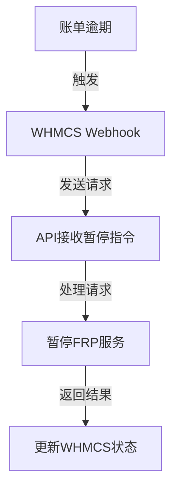
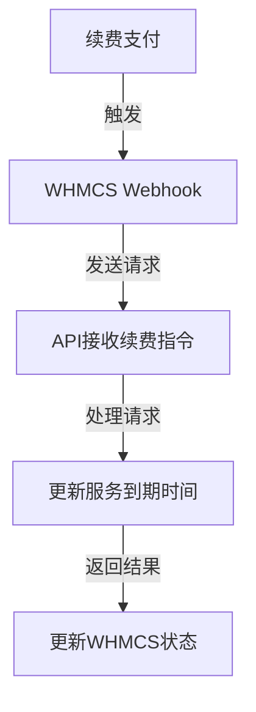

# FRP Manager API Docker 部署指南

## 目录
- [快速开始](#快速开始)
- [镜像信息](#镜像信息)
- [环境配置](#环境配置)
- [部署方式](#部署方式)
- [性能优化](#性能优化)
- [监控管理](#监控管理)
- [故障排除](#故障排除)
- [WHMCS 集成配置](#whmcs-集成配置)

## 快速开始

### 1. 拉取镜像
```bash
# Docker Hub
docker pull inkeds/frp-manager-api:latest

# 或者 GitHub Container Registry
docker pull ghcr.io/inkeds/frp-manager-api:latest
```

### 2. 准备环境文件
```bash
# 复制示例配置
cp .env.example .env

# 编辑配置文件
vim .env
```

### 3. 启动服务
```bash
# 使用 docker-compose 启动所有服务
docker-compose up -d

# 检查服务状态
docker-compose ps
```

### 4. 访问服务
- API 文档：http://localhost:8000/api/docs
- 健康检查：http://localhost:8000/health
- 监控指标：http://localhost:8000/metrics

## 镜像信息

### 1. 可用版本
```bash
inkeds/frp-manager-api:latest    # 最新版本
inkeds/frp-manager-api:1.0.0     # 特定版本
```

### 2. 镜像特性
- 基于 Python 3.9 slim 镜像
- 多阶段构建优化
- 非 root 用户运行
- 内置健康检查
- 资源使用优化

### 3. 镜像大小
- 基础镜像：~200MB
- 包含依赖：~500MB

## 环境配置

### 1. 必需的环境变量
```env
# 数据库配置
DATABASE_URL=sqlite:///./data/frp_manager.db

# Redis配置
REDIS_URL=redis://redis:6379/0

# 安全配置
SECRET_KEY=your-secret-key

# WHMCS配置
WHMCS_API_URL=https://your-whmcs-url/includes/api.php
WHMCS_IDENTIFIER=your-identifier
WHMCS_SECRET=your-secret
```

### 2. 可选环境变量
```env
# 应用配置
ENVIRONMENT=production           # 运行环境：production/development
API_URL=http://localhost:8000   # API访问地址
DEBUG=false                     # 调试模式

# 性能配置
WORKERS_PER_CORE=1              # 每核心工作进程数
MAX_WORKERS=4                   # 最大工作进程数
BACKLOG_SIZE=2048               # 连接队列大小

# 安全配置
ACCESS_TOKEN_EXPIRE_MINUTES=30   # Token过期时间
ALLOWED_HOSTS=*                 # 允许的主机
CORS_ORIGINS=["http://localhost:3000"]  # CORS配置

# 监控配置
SENTRY_DSN=your-sentry-dsn      # Sentry错误追踪
```

## 部署方式

### 1. 基础部署
```yaml
version: '3.8'
services:
  api:
    image: inkeds/frp-manager-api:latest
    ports:
      - "8000:8000"
    env_file:
      - .env
    volumes:
      - ./data:/app/data
```

### 2. 生产环境部署
```yaml
version: '3.8'
services:
  api:
    image: inkeds/frp-manager-api:latest
    ports:
      - "8000:8000"
    env_file:
      - .env
    volumes:
      - ./data:/app/data
      - ./logs:/app/logs
    deploy:
      resources:
        limits:
          cpus: '1'
          memory: 1G
    healthcheck:
      test: ["CMD", "curl", "-f", "http://localhost:8000/health"]
      interval: 30s
      timeout: 10s
      retries: 3
    restart: unless-stopped

  redis:
    image: redis:7-alpine
    volumes:
      - redis_data:/data
    deploy:
      resources:
        limits:
          cpus: '0.5'
          memory: 512M

volumes:
  redis_data:
```

## 性能优化

### 1. 资源限制建议
| 服务 | CPU | 内存 | 适用场景 |
|------|-----|------|----------|
| api | 0.5-1 核 | 512MB-1GB | 小型部署 |
| api | 2-4 核 | 2-4GB | 中型部署 |
| redis | 0.5 核 | 512MB | 缓存服务 |

### 2. 性能调优参数
```env
# 工作进程
WORKERS_PER_CORE=1
MAX_WORKERS=4

# 连接池
DB_POOL_SIZE=5
DB_MAX_OVERFLOW=10

# 缓存配置
CACHE_TTL=3600
```

### 3. 日志配置
```yaml
logging:
  driver: "json-file"
  options:
    max-size: "10m"
    max-file: "3"
```

## 监控管理

### 1. 健康检查
- 端点：`/health`
- 检查间隔：30秒
- 超时时间：10秒
- 重试次数：3次

### 2. 监控指标
- Prometheus指标：`/metrics`
- 主要指标：
  - 请求延迟
  - 错误率
  - 资源使用
  - 缓存命中率

### 3. 日志收集
- 应用日志：`/app/logs`
- 访问日志：`/app/logs/access.log`
- 错误日志：`/app/logs/error.log`

## 故障排除

### 1. 常见问题

#### 服务无法启动
```bash
# 检查日志
docker-compose logs api

# 检查配置
docker-compose config

# 检查端口
netstat -tulpn | grep 8000
```

#### 性能问题
```bash
# 查看资源使用
docker stats

# 检查连接数
docker exec -it redis redis-cli info | grep connected
```

#### 网络问题
```bash
# 检查网络
docker network ls
docker network inspect frp-manager-api_default

# 测试连接
docker exec -it api ping redis
```

### 2. 调试模式
```bash
# 启用调试日志
docker-compose up api

# 进入容器
docker-compose exec api bash

# 查看进程
docker-compose top
```

### 3. 重置服务
```bash
# 完全重置
docker-compose down -v
docker-compose up -d --force-recreate

# 仅重启服务
docker-compose restart api
```

### 4. 数据备份
```bash
# 备份数据
docker-compose exec redis redis-cli save

# 复制数据
docker cp frp-manager-api_redis_1:/data/dump.rdb ./backups/

# 备份数据库
docker-compose exec api python -m scripts.backup
```

## WHMCS 集成配置

### 1. WHMCS 系统要求
- WHMCS 版本：>= 8.0
- PHP 版本：>= 7.4
- 启用的 API 功能
- 有效的管理员账号

### 2. WHMCS 前置配置

#### 2.1 创建 API 凭证
1. 登录 WHMCS 管理面板
2. 进入 `设置` -> `系统设置` -> `API 凭证`
3. 点击 `创建新凭证`
4. 设置权限：
   ```
   - orders.*          # 订单管理权限
   - products.*        # 产品管理权限
   - clients.*         # 客户管理权限
   - billing.*         # 账单管理权限
   - system.*          # 系统管理权限
   ```
5. 保存并记录生成的 API Identifier 和 Secret

#### 2.2 配置产品
1. 进入 `系统设置` -> `产品/服务`
2. 创建新产品组：`FRP 服务`
3. 创建产品：
   ```
   产品名称：FRP 代理服务
   类型：其他服务
   付款类型：循环付款
   自动设置：是
   ```
4. 配置自定义字段：
   ```
   - local_port: 本地端口
   - remote_port: 远程端口
   - protocol: 协议类型 (tcp/udp/http)
   - domain: 域名 (可选)
   - bandwidth: 带宽限制
   - connections: 最大连接数
   ```

### 3. 环境变量配置

#### 3.1 基础配置
```env
# WHMCS API 配置
WHMCS_API_URL=https://your-whmcs-url/includes/api.php
WHMCS_IDENTIFIER=your-api-identifier
WHMCS_SECRET=your-api-secret

# WHMCS 产品配置
WHMCS_PRODUCT_ID=1              # FRP服务产品ID
WHMCS_PRODUCT_GROUP_ID=1        # FRP服务产品组ID

# WHMCS Webhook配置
WHMCS_WEBHOOK_SECRET=your-webhook-secret
```

#### 3.2 高级配置
```env
# WHMCS 同步设置
WHMCS_SYNC_INTERVAL=300         # 同步间隔（秒）
WHMCS_BATCH_SIZE=100           # 批量处理大小
WHMCS_RETRY_ATTEMPTS=3         # 失败重试次数
WHMCS_TIMEOUT=30               # API超时时间（秒）

# WHMCS 通知设置
WHMCS_NOTIFY_ON_PROVISION=true  # 开通服务时通知
WHMCS_NOTIFY_ON_SUSPEND=true    # 暂停服务时通知
WHMCS_NOTIFY_ON_UNSUSPEND=true  # 恢复服务时通知
WHMCS_NOTIFY_ON_TERMINATE=true  # 终止服务时通知
```

### 4. WHMCS 模块配置

#### 4.1 安装模块
1. 下载 WHMCS 模块文件：
```bash
docker cp frp-manager-api:/app/whmcs/frp_module modules/servers/frp_module
```

2. 配置模块权限：
```bash
chmod -R 755 modules/servers/frp_module
```

3. 在 WHMCS 中激活模块：
   - 进入 `系统设置` -> `服务器` -> `服务器模块`
   - 找到 `FRP Manager` 并启用

#### 4.2 模块配置项
```yaml
# 基础设置
api_url: http://your-api-url:8000
api_key: your-api-key
verify_ssl: true

# 资源限制
max_ports_per_user: 5
max_bandwidth_per_port: 100
max_connections_per_port: 1000

# 自动化设置
auto_setup: true
auto_terminate: true
suspend_on_overdue: true
```

### 5. 订单流程集成

#### 5.1 自动开通流程
1. 客户下单
2. WHMCS 接收订单
3. 支付完成
4. WHMCS 发送 Webhook
5. API 接收请求并处理：
   ```json
   {
     "event": "order_paid",
     "order_id": "123",
     "client_id": "456",
     "product_id": "1",
     "domain": "example.com",
     "custom_fields": {
       "local_port": "80",
       "remote_port": "8080",
       "protocol": "http"
     }
   }
   ```
6. API 创建 FRP 配置
7. 返回结果给 WHMCS
8. WHMCS 更新订单状态

#### 5.2 自动暂停流程


#### 5.3 服务续费流程


### 6. API 接口说明

#### 6.1 WHMCS 回调接口
```bash
# 服务开通
POST /api/v1/whmcs/provision
Content-Type: application/json
Authorization: Bearer your-token

{
  "service_id": "123",
  "client_id": "456",
  "product_id": "1",
  "domain": "example.com",
  "custom_fields": {
    "local_port": "80",
    "remote_port": "8080",
    "protocol": "http"
  }
}

# 服务暂停
POST /api/v1/whmcs/suspend
Content-Type: application/json
Authorization: Bearer your-token

{
  "service_id": "123",
  "reason": "payment_overdue"
}

# 服务恢复
POST /api/v1/whmcs/unsuspend
Content-Type: application/json
Authorization: Bearer your-token

{
  "service_id": "123"
}

# 服务终止
POST /api/v1/whmcs/terminate
Content-Type: application/json
Authorization: Bearer your-token

{
  "service_id": "123"
}
```

#### 6.2 状态同步接口
```bash
# 同步服务状态
POST /api/v1/whmcs/sync
Content-Type: application/json
Authorization: Bearer your-token

{
  "service_ids": ["123", "456"]
}

# 获取使用统计
GET /api/v1/whmcs/stats/{service_id}
Authorization: Bearer your-token
```

### 7. 故障排除

#### 7.1 常见问题
1. WHMCS 连接失败
```bash
# 检查API配置
docker-compose exec api python -m scripts.check_whmcs_connection

# 查看WHMCS日志
docker-compose logs api | grep WHMCS
```

2. 自动开通失败
```bash
# 检查Webhook配置
curl -v -X POST http://your-api:8000/api/v1/whmcs/webhook

# 查看开通日志
docker-compose exec api cat /app/logs/provision.log
```

3. 状态同步问题
```bash
# 手动触发同步
docker-compose exec api python -m scripts.sync_whmcs_services

# 检查同步日志
docker-compose exec api cat /app/logs/sync.log
```

#### 7.2 调试模式
```env
# 启用WHMCS调试
WHMCS_DEBUG=true
WHMCS_LOG_LEVEL=debug

# 查看调试日志
docker-compose exec api cat /app/logs/whmcs_debug.log
```

#### 7.3 测试工具
```bash
# 测试WHMCS API连接
docker-compose exec api python -m scripts.test_whmcs_api

# 测试Webhook
docker-compose exec api python -m scripts.test_whmcs_webhook

# 验证产品配置
docker-compose exec api python -m scripts.verify_whmcs_products
